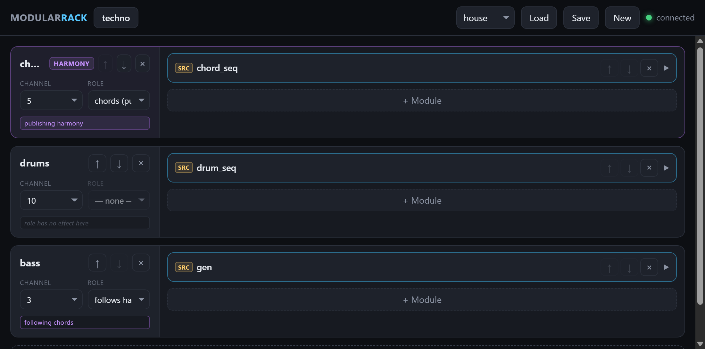
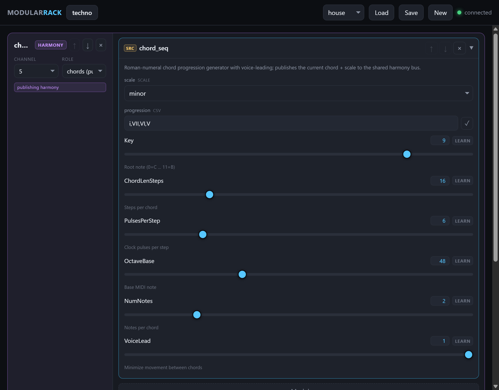
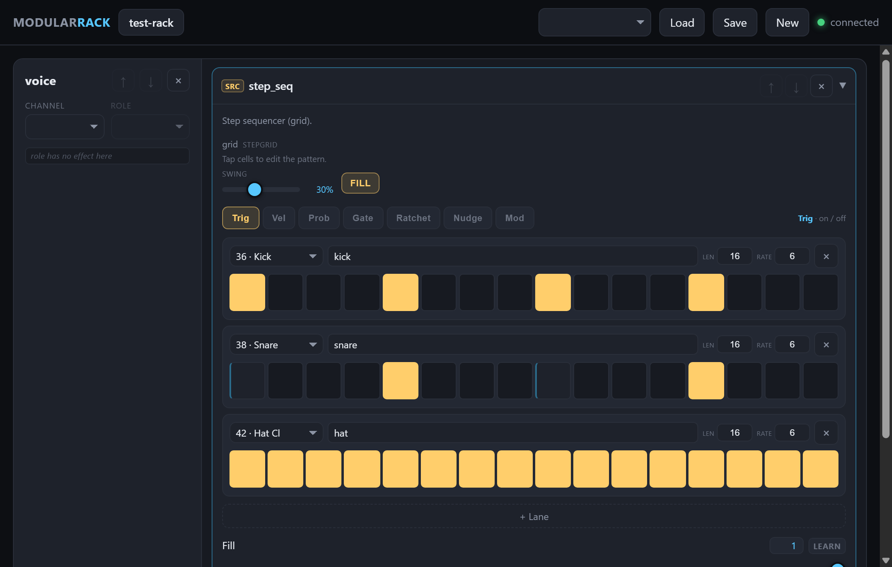

# RackForce

[](../../releases)

A browser-patchable modular MIDI rack for the **Akai Force**, running as a
[MockbaMod](https://github.com/MockbaTheBorg/MockbaMod) AddOn. Generative and
Euclidean sequencers, a drum machine, a chord engine, quantizers, LFOs — wired
together and driving the Force's own synths over MIDI. Design takes cues from
Mutable Instruments' Eurorack modules (Marbles, Grids, Tides, Branches): the
Force makes the sound, RackForce makes the musical decisions.

Runs alongside Akai's own app as an overlay AddOn — doesn't touch the firmware.

### [Download RackForce v0.2.0-beta](https://github.com/Devko/RackForce/releases/tag/v0.2.0-beta)

Prebuilt ARM binary, no GitHub account or build step needed — grab the
`.zip` from the "Assets" section on that page. See [Install](#install) below
for what to do with it.

> v0.2.0-beta — early build, expect rough edges. Bug reports welcome, see
> [Feedback](#feedback).

## Screenshots

The web patch bay — open from any phone or laptop on the same network — is
the easiest way to see what RackForce actually is:

**A patch, built from three voices — a chord engine publishing harmony, a
drum machine, and a bassline following the changes:**


**Every parameter is a live slider, not just a config file:**


**The step sequencer is a paged, Elektron/Opal-style editor with mouse-drag
painting:**


## Highlights

- **Musicality pass** — velocity accents, humanization, phrase-aware
  generative lines, fixed chord voice-leading, per-drum note config.
- **Routing** — MIDI-In brings live Force pads/keys into a chain; a named
  internal note bus (`bus_send`/`bus_in`) fans one lane's output into others.
- **Live config edits** — changing a genre/scale/key mid-playback no longer
  panics all notes off and restarts the transport.
- **Opal-style step editor** — paged (Trig/Vel/Prob/Gate/Ratchet/Nudge/Mod),
  mouse-drag painting of values across steps.
- **23 drum genres**, key/root picker on Gen/Marbles/Markov/Turing, and an
  honest publisher/follower harmony badge in the web UI.

## Requirements

- Akai Force running **MockbaMod 4.51** (or compatible)
- SSH access to the Force, to make the binary executable and enable the AddOn

## Install

1. Download `RackForce-v0.2.0-beta.zip` from the [v0.2.0-beta release page](https://github.com/Devko/RackForce/releases/tag/v0.2.0-beta) (all versions: [Releases](../../releases)).
2. Copy the `ModularRack` folder it contains onto your MockbaMod SD card, into:

   ```
   <SD card>/AddOns/ModularRack/
   ```

   (The AddOn folder keeps the `ModularRack` name on disk — same engine,
   RackForce is the project name.)

3. Zip files don't preserve Unix permissions, so make the binary and scripts
   executable over SSH:

   ```sh
   chmod +x /media/662522/AddOns/ModularRack/modularrack
   chmod +x /media/662522/AddOns/ModularRack/manage.sh
   chmod +x /media/662522/AddOns/ModularRack/run_modularrack.sh
   ```

4. Enable it:

   ```sh
   cd /media/662522/AddOns/ModularRack
   sh manage.sh ENABLE
   ```

   Starts the rack immediately and sets it to auto-launch on boot.
   `sh manage.sh DISABLE` stops it and removes auto-launch;
   `sh manage.sh UNINSTALL` also deletes the AddOn folder.

## Docs

- **[MIDI setup](docs/MIDI.md)** — voice routing, the channel-16 control
  scheme, macro knobs, the web patch bay.
- **[Module catalog](docs/MODULES.md)** — all 20 modules, what each does.

## Feedback

Open an [issue](../../issues), ideally with the output of running the daemon
directly over SSH with `--verbose`:

```sh
/media/662522/AddOns/ModularRack/modularrack --verbose
```

## Credits

- Built on [MockbaMod](https://github.com/MockbaTheBorg/MockbaMod) 4.51 by
  MockbaTheBorg and Amit Talwar.
- Module design inspired by Mutable Instruments (Marbles, Grids, Tides,
  Branches) and the Music Thing Modular Turing Machine.
